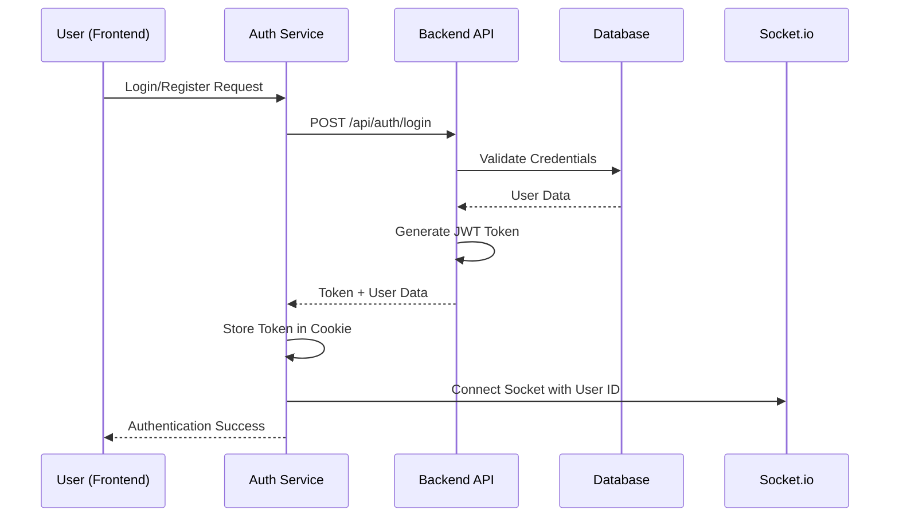
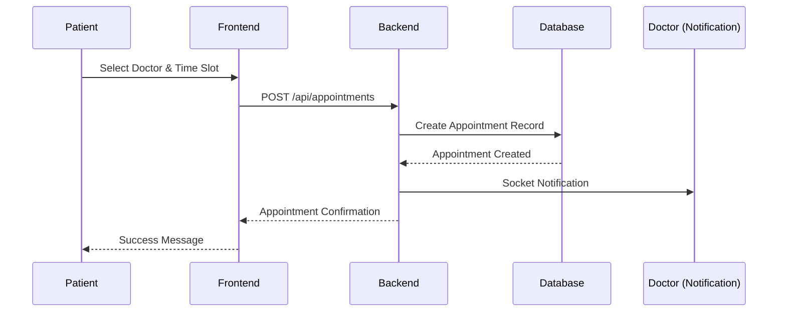
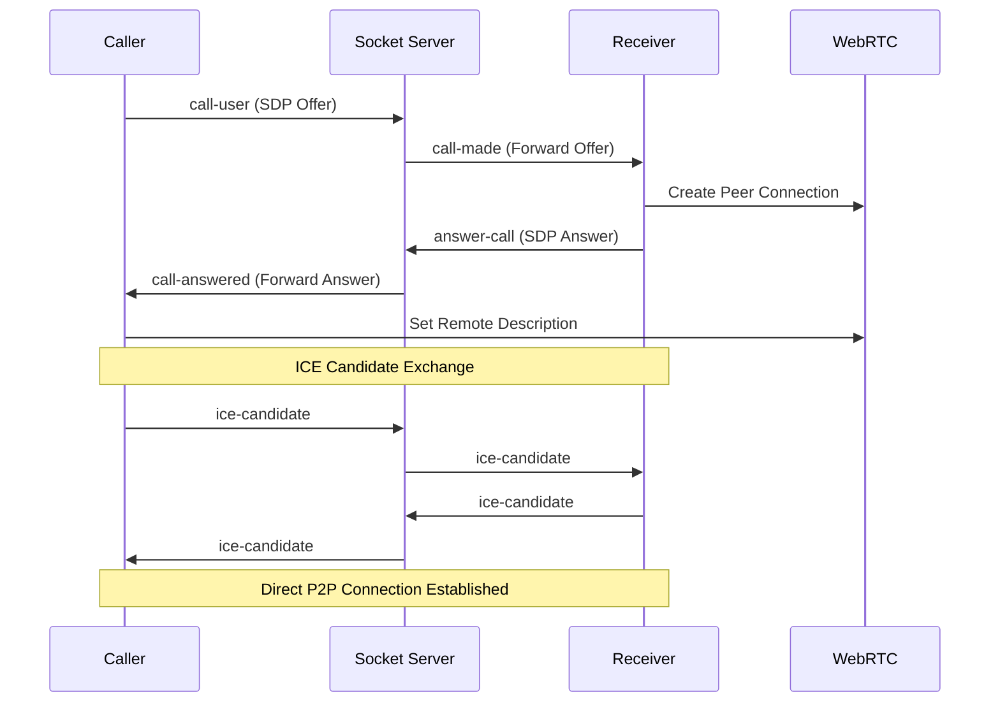
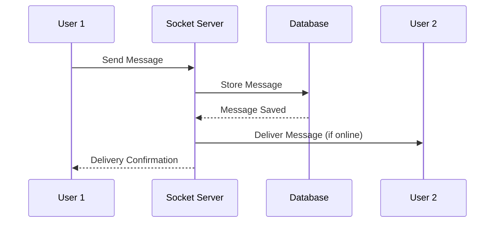

# Health-Connect MERN Project - Comprehensive Analysis

## 🏥 Project Overview

**Health-Connect** is a comprehensive healthcare platform built using the MERN (MongoDB, Express.js, React, Node.js) stack that facilitates seamless doctor-patient interactions. The platform integrates real-time communication, video consultations, appointment scheduling, and medical record management in a secure, user-friendly environment.

### ✨ Core Functionality

- **Role-based Authentication**: Separate workflows for doctors and patients
- **Appointment Management**: Complete scheduling system with status tracking
- **Real-time Communication**: Live chat and video calling using WebRTC and Socket.io
- **Medical Records**: Patient history and appointment notes management
- **Profile Management**: Comprehensive user profiles with medical data

---

## 🏗️ Architecture Overview

### Technology Stack

#### Backend Technologies

```
Node.js v18+          → Runtime environment
Express.js v4.21.2    → Web framework
MongoDB v8.12.1       → NoSQL database
Mongoose v8.12.1      → MongoDB ODM
Socket.io v4.8.1      → Real-time communication
JWT v9.0.2            → Authentication tokens
bcryptjs v3.0.2       → Password hashing
Cloudinary v2.6.0     → Media storage
```

#### Frontend Technologies

```
React v19.0.0         → UI library
TypeScript v5.7.2     → Static typing
Vite v6.2.0           → Build tool
TailwindCSS v4.0.13   → Styling framework
React Router v7.3.0   → Client-side routing
Socket.io-client v4.8.1 → Real-time client
Axios v1.8.4          → HTTP client
simple-peer v9.11.1   → WebRTC peer connections
```

### System Architecture

```
┌─────────────────┐    ┌─────────────────┐    ┌─────────────────┐
│   Frontend      │    │     Backend     │    │    Database     │
│   (React)       │    │   (Express)     │    │   (MongoDB)     │
├─────────────────┤    ├─────────────────┤    ├─────────────────┤
│ • Components    │◄──►│ • REST APIs     │◄──►│ • Users         │
│ • Context API   │    │ • Controllers   │    │ • Appointments  │
│ • Services      │    │ • Middleware    │    │ • Messages      │
│ • TypeScript    │    │ • Models        │    │ • Media Files   │
└─────────────────┘    └─────────────────┘    └─────────────────┘
         │                       │
         └───────────────────────┘
              Socket.io
           Real-time Layer
```

---

## 📁 Detailed Folder Structure

### Backend Structure (`/backend`)

```
backend/
├── package.json                 → Dependencies & scripts
├── src/
│   ├── index.js                → Server entry point
│   ├── controllers/            → Business logic
│   │   ├── authController.js   → Authentication logic
│   │   ├── doctorController.js → Doctor operations
│   │   ├── patientController.js → Patient operations
│   │   ├── appointmentController.js → Appointment CRUD
│   │   └── messageController.js → Chat functionality
│   ├── models/                 → Database schemas
│   │   ├── Doctor.js          → Doctor data model
│   │   ├── Patient.js         → Patient data model
│   │   ├── Appointment.js     → Appointment model
│   │   └── Message.js         → Chat message model
│   ├── routes/                → API endpoints
│   │   ├── auth.js           → Authentication routes
│   │   ├── doctors.js        → Doctor routes
│   │   ├── patients.js       → Patient routes
│   │   ├── appointments.js   → Appointment routes
│   │   └── message.js        → Messaging routes
│   ├── middleware/            → Custom middleware
│   │   └── auth.js           → JWT authentication
│   └── lib/                  → Utilities
│       ├── db.js             → Database connection
│       ├── socket.js         → Socket.io configuration
│       ├── cloudinary.js     → File upload handling
│       └── utils.js          → Helper functions
```

### Frontend Structure (`/frontend`)

```
frontend/
├── package.json              → Dependencies & scripts
├── vite.config.ts           → Build configuration
├── src/
│   ├── App.tsx              → Main application component
│   ├── main.tsx             → React entry point
│   ├── components/          → Reusable UI components
│   │   ├── Navbar.tsx       → Navigation bar
│   │   ├── VideoCall.tsx    → Video call interface
│   │   ├── MessageInput.tsx → Chat input component
│   │   └── LoadingSpinner.tsx → Loading indicator
│   ├── pages/               → Route components
│   │   ├── Login.tsx        → Authentication page
│   │   ├── SignUp.tsx       → Registration page
│   │   ├── DoctorList.tsx   → Doctor browsing
│   │   ├── DoctorDashboard.tsx → Doctor interface
│   │   ├── PatientAppointments.tsx → Patient appointments
│   │   ├── DoctorProfile.tsx → Doctor profile management
│   │   ├── PatientProfile.tsx → Patient profile management
│   │   ├── Chat.tsx         → Messaging interface
│   │   └── DoctorPage.tsx   → Individual doctor page
│   ├── context/             → State management
│   │   ├── AppContext.tsx   → Global app state
│   │   ├── VideoCallContext.tsx → Video call state
│   │   └── MessageContext.tsx → Chat state
│   ├── services/            → API integration
│   │   ├── api.service.ts   → Generic API calls
│   │   ├── auth.service.ts  → Authentication API
│   │   ├── doctor.service.ts → Doctor API
│   │   └── appointment.service.ts → Appointment API
│   ├── types/               → TypeScript definitions
│   │   ├── index.ts         → Main type definitions
│   │   └── types.ts         → Additional types
│   └── utils/               → Helper functions
│       ├── auth.ts          → Authentication utilities
│       └── axios.ts         → HTTP client configuration
```

---

## 🗄️ Database Schema Design

### Doctor Model

```javascript
{
  name: String (required),
  email: String (unique, required),
  password: String (hashed, required),
  specialization: String (required),
  experience: Number (required),
  qualification: String (required),
  about: String (optional),
  contactNumber: String (optional),
  avatar: String (Cloudinary URL),
  schedule: [{
    day: String (enum: weekdays),
    slots: [{
      slotNumber: Number,
      startTime: String,
      endTime: String,
      isAvailable: Boolean (default: true)
    }]
  }],
  timestamps: true
}
```

### Patient Model

```javascript
{
  name: String (required),
  email: String (unique, required),
  password: String (hashed, required),
  dateOfBirth: String (optional),
  gender: String (enum: ['male', 'female', ''], optional),
  allergies: String (optional),
  contactNumber: String (optional),
  emergencyContact: [{
    name: String (required),
    relationship: String (required),
    phone: String (required)
  }],
  bloodGroup: String (enum: blood types, optional),
  profileCompleted: Boolean (default: false),
  avatar: String (Cloudinary URL),
  timestamps: true
}
```

### Appointment Model

```javascript
{
  doctorId: ObjectId (ref: 'Doctor', required),
  patientId: ObjectId (ref: 'Patient', required),
  date: String (required),
  startTime: String (required),
  endTime: String (required),
  status: String (enum: ['pending', 'scheduled', 'completed', 'cancelled', 'rescheduled'], default: 'pending'),
  mode: String (enum: ['video', 'chat'], default: 'chat'),
  reason: String (optional),
  comment: String (optional),
  notes: String (optional),
  rating: Number (optional),
  review: String (optional),
  timestamps: true
}
```

### Message Model

```javascript
{
  senderId: ObjectId (ref: 'User', required),
  receiverId: ObjectId (ref: 'User', required),
  text: String (optional),
  image: String (Cloudinary URL, optional),
  read: Boolean (default: false),
  type: String (enum: ['text', 'image'], default: 'text'),
  timestamps: true
}
```

---

## 🔄 Data Flow Analysis

### 1. Authentication Flow



### 2. Appointment Booking Flow



### 3. Real-time Video Call Flow



### 4. Chat Message Flow



---

## 🔧 Key Components Interaction

### Frontend State Management

#### AppContext (Global State)

```typescript
interface AppContextType {
  currentUser: Doctor | Patient | null;
  socket: Socket | null;
  isDarkMode: boolean;
  isLoading: boolean;
  error: string | null;
  // Methods
  login: (credentials) => Promise<void>;
  signup: (data) => Promise<void>;
  logout: () => Promise<void>;
  getCurrentUser: () => Promise<User>;
  connectSocket: (userId) => void;
  toggleDarkMode: () => void;
}
```

#### VideoCallContext (WebRTC State)

```typescript
interface VideoCallContextType {
  isInCall: boolean;
  localStream: MediaStream | null;
  remoteStream: MediaStream | null;
  callStatus: "idle" | "calling" | "ringing" | "connected";
  callerId: string | null;
  // Methods
  startCall: (userId) => Promise<void>;
  answerCall: () => Promise<void>;
  rejectCall: () => void;
  endCall: () => void;
}
```

### Backend Architecture Patterns

#### Controller Pattern

```javascript
// Example: appointmentController.js
export const createAppointment = async (req, res) => {
  try {
    // 1. Validate request data
    // 2. Check user permissions
    // 3. Business logic execution
    // 4. Database operations
    // 5. Response formatting
  } catch (error) {
    // Error handling
  }
};
```

#### Middleware Chain
The middleware chain is a fundamental Express.js pattern where requests pass through a series of functions before reaching the final route handler.

Incoming Request → protect → validateInput → createAppointment → Response
                     ↓           ↓              ↓
                 JWT Check   Input Valid    Business Logic

```javascript
// Authentication flow
router.use(protect);// Applied to ALL routes in this router // EVERY endpoint will go through JWT verification
router.post("/", validateInput, createAppointment);
//               ↑              ↑
//          Middleware 1    Final Handler
```

---

## 🚀 Real-time Features Implementation

### Socket.io Architecture

#### Connection Management

```javascript
// Server-side connection handling
const onlineUsers = new Map(); // userId -> socketId mapping

io.on("connection", (socket) => {
  const userId = socket.handshake.query.userId;
  onlineUsers.set(userId, socket.id);

  // Event handlers for video calls
  socket.on("call-user", handleCallOffer);
  socket.on("answer-call", handleCallAnswer);
  socket.on("ice-candidate", handleIceCandidate);
  socket.on("call-end", handleCallEnd);
});
```

#### WebRTC Implementation

```javascript
// Peer connection configuration
const peerConfiguration = {
  iceServers: [
    { urls: "stun:stun.l.google.com:19302" },
    { urls: "stun:stun1.l.google.com:19302" },
  ],
};

// Video call initiation
const startCall = async (userId) => {
  const stream = await navigator.mediaDevices.getUserMedia({
    video: true,
    audio: true,
  });

  const peerConnection = new RTCPeerConnection(peerConfiguration);
  stream.getTracks().forEach((track) => {
    peerConnection.addTrack(track, stream);
  });

  const offer = await peerConnection.createOffer();
  await peerConnection.setLocalDescription(offer);

  socket.emit("call-user", { to: userId, offer });
};
```

---

## 🔐 Security Implementation

### Authentication & Authorization

#### JWT Token System

```javascript
// Token generation
const generateToken = (userId, role, res) => {
    // 1. Create JWT payload with user info
    //     Uses JWT_SECRET from environment variables
    //     Creates tamper-proof signature
  const token = jwt.sign({ userId, role }, JWT_SECRET, { expiresIn: "7d" });

    // 2. Set secure httpOnly cookie
  res.cookie("token", token, {
    httpOnly: true, //JavaScript cannot access cookie (XSS protection)
    secure: process.env.NODE_ENV === "production", // HTTPS only in production
    sameSite: "strict",
    maxAge: 7 * 24 * 60 * 60 * 1000, // 7 days
  });
};

// Token verification middleware
export const protect = async (req, res, next) => {
  // 1. Extract token from httpOnly cookie
  const token = req.cookies.token;
  if (!token) return res.status(401).json({ message: "Unauthorized" });
// 2. Verify token signature and expiration
  const decoded = jwt.verify(token, JWT_SECRET);
  // 3. Fetch fresh user data from database
  const user = await getUserById(decoded.userId, decoded.role);

    // 4. Attach user info to request object
  req.user = user;
  req.userRole = decoded.role;
  next();  // 5. Continue to next middleware/route handler
};
```

#### Password Security

```javascript
// Password hashing (in model pre-save hook)
doctorSchema.pre("save", async function (next) {
  if (!this.isModified("password")) return next();
  const salt = await bcrypt.genSalt(14);
  this.password = await bcrypt.hash(this.password, salt);
  next();
});

// Password comparison
doctorSchema.methods.comparePassword = async function (candidatePassword) {
  return await bcrypt.compare(candidatePassword, this.password);
};
```

---

## 🌐 API Endpoints Documentation

### Authentication Endpoints

```
POST   /api/auth/register    → User registration
POST   /api/auth/login       → User authentication
POST   /api/auth/logout      → User logout
GET    /api/auth/me          → Get current user
```

### Doctor Endpoints

```
GET    /api/doctors          → List all doctors
GET    /api/doctors/:id      → Get specific doctor
PUT    /api/doctors/profile  → Update doctor profile
```

### Patient Endpoints

```
GET    /api/patients         → List all patients (admin)
GET    /api/patients/:id     → Get specific patient
PUT    /api/patients/profile → Update patient profile
```

### Appointment Endpoints

```
GET    /api/appointments           → Get all appointments
GET    /api/appointments/doctor    → Get doctor's appointments
GET    /api/appointments/patient   → Get patient's appointments
POST   /api/appointments           → Create new appointment
PUT    /api/appointments/:id       → Update appointment
DELETE /api/appointments/:id       → Delete appointment
```

### Message Endpoints

```
Real-time messaging handled via Socket.io events:
- message-send     → Send new message
- message-receive  → Receive message
- typing-start     → User started typing
- typing-stop      → User stopped typing
```

---

## 🎯 Key Features Breakdown

### 1. User Management System

- **Role-based Access**: Separate interfaces for doctors and patients
- **Profile Completion**: Progressive profile building with validation
- **Avatar Upload**: Cloudinary integration for image storage
- **Medical History**: Comprehensive patient medical data

### 2. Appointment System

- **Time Slot Management**: Doctor-defined availability slots
- **Status Tracking**: pending → scheduled → completed workflow
- **Multiple Modes**: Video call or chat-based appointments
- **Rating & Reviews**: Post-appointment feedback system

### 3. Real-time Communication

- **Live Chat**: Instant messaging with read receipts
- **Video Calls**: WebRTC-based peer-to-peer video communication
- **File Sharing**: Image sharing in chat
- **Online Presence**: Real-time user status tracking

### 4. Video Call Technology

- **WebRTC Implementation**: Direct peer-to-peer connection
- **STUN Server**: NAT traversal for connection establishment
- **Media Controls**: Mute/unmute, video on/off
- **Call States**: idle → calling → ringing → connected

---

## 🔧 Development Workflow

### Backend Development Flow

1. **Model Definition**: Define MongoDB schemas with Mongoose
2. **Controller Logic**: Implement business logic and validation
3. **Route Setup**: Define API endpoints and middleware
4. **Authentication**: JWT-based auth with role checking
5. **Socket Events**: Real-time event handling

### Frontend Development Flow

1. **Component Architecture**: Reusable React components
2. **State Management**: Context API for global state
3. **Service Layer**: Axios-based API communication
4. **Type Safety**: TypeScript for compile-time checking
5. **Real-time Integration**: Socket.io client connection

### Build & Deployment

```bash
# Backend
npm install          → Install dependencies
npm run dev         → Development server with nodemon
npm start           → Production server

# Frontend
npm install          → Install dependencies
npm run dev         → Vite development server
npm run build       → Production build
npm run preview     → Preview production build
```

---

## 🚀 Performance Considerations

### Database Optimization

- **Indexing**: Efficient queries on doctorId, patientId, and date fields
- **Population**: Selective field population for appointments
- **Aggregation**: Complex queries for dashboard statistics

### Frontend Optimization

- **Code Splitting**: Route-based lazy loading
- **Image Optimization**: Cloudinary transformations
- **State Optimization**: Selective context updates
- **WebRTC Optimization**: Efficient peer connection management

### Real-time Optimization

- **Connection Pooling**: Efficient socket connection management
- **Event Batching**: Reduce unnecessary socket emissions
- **Memory Management**: Proper cleanup of media streams

---

## 🔍 How It All Works Together

### User Journey Example: Patient Books Video Appointment

1. **Authentication**: Patient logs in, JWT token stored in httpOnly cookie
2. **Socket Connection**: Automatic socket.io connection with user ID
3. **Doctor Discovery**: Browse doctors with specialization filtering
4. **Appointment Booking**: Select time slot, create appointment record
5. **Real-time Notification**: Doctor receives instant notification via socket
6. **Appointment Confirmation**: Status updates in real-time
7. **Video Call**: WebRTC peer-to-peer connection when appointment time arrives
8. **Chat Integration**: Fallback to text chat if video fails
9. **Post-Appointment**: Rating, review, and medical notes

### Data Persistence & Sync

- **Database Consistency**: All appointment data stored in MongoDB
- **Real-time Sync**: Socket.io ensures UI updates across devices
- **Offline Handling**: Service worker for basic offline functionality
- **Error Recovery**: Automatic reconnection and state restoration

This comprehensive healthcare platform demonstrates a complete MERN stack implementation with modern web technologies, focusing on real-time communication, security, and user experience. The modular architecture allows for easy maintenance and feature expansion.

---

## 📚 Detailed File Documentation

### 🔧 Backend Function Documentation

#### `authController.js` - Authentication Management

```javascript
/**
 * Handles user registration for both doctors and patients
 * @param {Object} req - Express request object
 * @param {Object} req.body - Request body containing user data
 * @param {string} req.body.name - User's full name
 * @param {string} req.body.email - User's email address
 * @param {string} req.body.password - User's password (will be hashed)
 * @param {string} req.body.role - User role ('doctor' or 'patient')
 * @param {Object} req.body.additionalData - Role-specific additional data
 * @param {Object} res - Express response object
 * @returns {Object} JSON response with user data and JWT token
 */
export const register = async (req, res) => {
  /* Implementation */
};

/**
 * Authenticates user login credentials
 * @param {Object} req - Express request object
 * @param {string} req.body.email - User's email
 * @param {string} req.body.password - User's password
 * @param {string} req.body.role - User role for targeted authentication
 * @param {Object} res - Express response object
 * @returns {Object} JSON response with authenticated user data
 */
export const login = async (req, res) => {
  /* Implementation */
};

/**
 * Retrieves current authenticated user information
 * @param {Object} req - Express request object with authenticated user
 * @param {Object} req.user - Authenticated user object from middleware
 * @param {string} req.userRole - User role from JWT token
 * @param {Object} res - Express response object
 * @returns {Object} JSON response with current user data
 */
export const getCurrentUser = async (req, res) => {
  /* Implementation */
};

/**
 * Logs out user by clearing authentication cookie
 * @param {Object} req - Express request object
 * @param {Object} res - Express response object
 * @returns {Object} JSON response confirming logout
 */
export const logout = async (req, res) => {
  /* Implementation */
};
```

#### `doctorController.js` - Doctor Management

```javascript
/**
 * Retrieves all doctors with public profile information
 * @param {Object} req - Express request object
 * @param {Object} res - Express response object
 * @returns {Array} JSON array of doctor profiles (password excluded)
 */
export const getDoctors = async (req, res) => {
  /* Implementation */
};

/**
 * Retrieves a specific doctor by ID
 * @param {Object} req - Express request object
 * @param {string} req.params.id - Doctor's MongoDB ObjectId
 * @param {Object} res - Express response object
 * @returns {Object} JSON object with doctor profile data
 */
export const getDoctor = async (req, res) => {
  /* Implementation */
};

/**
 * Updates doctor profile (only by authenticated doctor)
 * @param {Object} req - Express request object
 * @param {Object} req.user - Authenticated doctor object
 * @param {Object} req.body - Updated profile data
 * @param {Object} res - Express response object
 * @returns {Object} JSON response with updated doctor profile
 */
export const updateDoctorProfile = async (req, res) => {
  /* Implementation */
};

/**
 * Adds a patient review for a doctor
 * @param {Object} req - Express request object
 * @param {string} req.params.id - Doctor's ID to review
 * @param {Object} req.body - Review data
 * @param {number} req.body.rating - Rating (1-5)
 * @param {string} req.body.comment - Review comment
 * @param {Object} res - Express response object
 * @returns {Object} JSON response with updated doctor data
 */
export const addReview = async (req, res) => {
  /* Implementation */
};
```

#### `appointmentController.js` - Appointment Management

```javascript
/**
 * Retrieves all appointments for authenticated user (doctor or patient)
 * @param {Object} req - Express request object
 * @param {Object} req.user - Authenticated user object
 * @param {Object} res - Express response object
 * @returns {Array} JSON array of appointments with populated doctor/patient data
 */
export const getAppointments = async (req, res) => {
  /* Implementation */
};

/**
 * Creates a new appointment (patient only)
 * @param {Object} req - Express request object
 * @param {Object} req.body - Appointment data
 * @param {string} req.body.doctorId - Target doctor's ObjectId
 * @param {string} req.body.date - Appointment date
 * @param {string} req.body.startTime - Start time
 * @param {string} req.body.endTime - End time
 * @param {string} req.body.mode - Appointment mode ('video' or 'chat')
 * @param {string} req.body.reason - Reason for appointment
 * @param {Object} res - Express response object
 * @returns {Object} JSON response with created appointment data
 */
export const createAppointment = async (req, res) => {
  /* Implementation */
};

/**
 * Updates existing appointment (authorized users only)
 * @param {Object} req - Express request object
 * @param {string} req.params.id - Appointment ObjectId
 * @param {Object} req.body - Updated appointment data
 * @param {Object} res - Express response object
 * @returns {Object} JSON response with updated appointment
 */
export const updateAppointment = async (req, res) => {
  /* Implementation */
};

/**
 * Retrieves all appointments for a specific doctor
 * @param {Object} req - Express request object
 * @param {Object} req.user - Authenticated doctor object
 * @param {Object} res - Express response object
 * @returns {Array} JSON array of doctor's appointments with patient data
 */
export const getDoctorAppointments = async (req, res) => {
  /* Implementation */
};

/**
 * Retrieves all appointments for authenticated patient
 * @param {Object} req - Express request object
 * @param {Object} req.user - Authenticated patient object
 * @param {Object} res - Express response object
 * @returns {Array} JSON array of patient's appointments with doctor data
 */
export const getPatientAppointments = async (req, res) => {
  /* Implementation */
};
```

#### `auth.js` (Middleware) - Authentication & Authorization

```javascript
/**
 * Verifies JWT token and extracts user information
 * @param {string} token - JWT token from cookie
 * @returns {Object} Object containing userId and role
 * @throws {Error} If token is invalid or expired
 */
const verifyToken = async (token) => {
  /* Implementation */
};

/**
 * Middleware to protect routes requiring authentication
 * @param {Object} req - Express request object
 * @param {Object} res - Express response object
 * @param {Function} next - Express next middleware function
 * @sets req.user - Authenticated user object
 * @sets req.userRole - User role ('doctor' or 'patient')
 * @sets req.token - JWT token
 */
export const protect = async (req, res, next) => {
  /* Implementation */
};

/**
 * Middleware to restrict access to doctors only
 * @param {Object} req - Express request object (must have userRole)
 * @param {Object} res - Express response object
 * @param {Function} next - Express next middleware function
 */
export const doctorOnly = (req, res, next) => {
  /* Implementation */
};

/**
 * Middleware to restrict access to patients only
 * @param {Object} req - Express request object (must have userRole)
 * @param {Object} res - Express response object
 * @param {Function} next - Express next middleware function
 */
export const patientOnly = (req, res, next) => {
  /* Implementation */
};
```

#### `socket.js` - Real-time Communication

```javascript
/**
 * Retrieves socket ID for a given user ID
 * @param {string} id - User's MongoDB ObjectId
 * @returns {string|undefined} Socket ID if user is online
 */
export const getSocketId = (id) => {
  /* Implementation */
};

/**
 * Handles Socket.io connection events and video call signaling
 * @param {Object} io - Socket.io server instance
 * Sets up event listeners for:
 * - connection: User connects to socket
 * - call-user: Initiates video call with WebRTC offer
 * - answer-call: Responds to video call with WebRTC answer
 * - ice-candidate: Exchanges ICE candidates for NAT traversal
 * - call-rejected: Handles call rejection
 * - call-end: Handles call termination
 * - disconnect: Cleans up user from online users map
 */
const handleSocketConnection = (io) => {
  /* Implementation */
};
```

### 🎨 Frontend Function Documentation

#### `AppContext.tsx` - Global State Management

```typescript
/**
 * Registers a new user (doctor or patient)
 * @param {SignUpFormData} data - User registration data
 * @returns {Promise<void>}
 * Sets currentUser state and establishes socket connection
 */
const signup = async (data: SignUpFormData) => {
  /* Implementation */
};

/**
 * Authenticates user login
 * @param {LoginCredentials} data - Login credentials
 * @returns {Promise<void>}
 * Sets currentUser state and establishes socket connection
 */
const login = async (data: LoginCredentials) => {
  /* Implementation */
};

/**
 * Establishes Socket.io connection with user ID
 * @param {string} id - User's MongoDB ObjectId
 * Sets up socket event listeners and connection handlers
 */
const connectSocket = (id: string) => {
  /* Implementation */
};

/**
 * Fetches current authenticated user data
 * @returns {Promise<{data: {data: any; success: boolean; message: string}}>}
 * Updates currentUser state with fresh data from server
 */
const getCurrentUser = async () => {
  /* Implementation */
};
```

#### `VideoCallContext.tsx` - WebRTC Call Management

```typescript
/**
 * Creates a new RTCPeerConnection with event handlers
 * @returns {RTCPeerConnection} Configured peer connection
 * Sets up ICE candidate handling, connection state monitoring, and remote stream handling
 */
const createPeerConnection = () => {
  /* Implementation */
};

/**
 * Initiates a video call to another user
 * @param {string} userId - Target user's ObjectId
 * @returns {Promise<void>}
 * Gets user media, creates peer connection, generates offer, and sends via socket
 */
const startCall = async (userId: string) => {
  /* Implementation */
};

/**
 * Answers an incoming video call
 * @returns {Promise<void>}
 * Gets user media, creates peer connection, sets remote offer, generates answer
 */
const answerCall = async () => {
  /* Implementation */
};

/**
 * Ends the current video call
 * Emits call-end event to remote peer and cleans up all call resources
 */
const endCall = () => {
  /* Implementation */
};

/**
 * Cleans up all call-related resources
 * Stops media streams, closes peer connection, resets state
 */
const cleanupCall = () => {
  /* Implementation */
};
```

---

## 📦 Dependency Mapping

### Backend Dependencies (`package.json`)

#### Core Dependencies

```json
{
  "express": "^4.21.2", // Web framework for Node.js
  "mongoose": "^8.12.1", // MongoDB object modeling for Node.js
  "socket.io": "^4.8.1", // Real-time bidirectional event-based communication
  "jsonwebtoken": "^9.0.2", // JSON Web Token implementation
  "bcryptjs": "^3.0.2", // Password hashing library
  "cloudinary": "^2.6.0", // Cloud-based image and video management
  "cors": "^2.8.5", // Cross-Origin Resource Sharing middleware
  "cookie-parser": "^1.4.7", // Parse HTTP request cookies
  "dotenv": "^16.4.7", // Environment variable loader
  "express-validator": "^7.2.1" // Server-side data validation
}
```

#### Dependency Usage Analysis

- **Express.js**: HTTP server framework, handles routing, middleware, and request/response processing
- **Mongoose**: MongoDB ODM for schema definition, data validation, and database operations
- **Socket.io**: Real-time communication for video calls, chat, and live notifications
- **JWT**: Stateless authentication, secure token generation and verification
- **bcryptjs**: Password security through salted hashing (14 rounds)
- **Cloudinary**: Avatar and medical image storage with URL-based transformations
- **CORS**: Cross-origin requests handling for frontend-backend communication
- **Cookie-parser**: Secure httpOnly cookie handling for JWT tokens
- **Express-validator**: Input validation and sanitization for API endpoints

### Frontend Dependencies (`package.json`)

#### Core Dependencies

```json
{
  "react": "^19.0.0", // UI library for building user interfaces
  "react-dom": "^19.0.0", // DOM rendering for React
  "react-router-dom": "^7.3.0", // Client-side routing for SPA
  "typescript": "~5.7.2", // Static type checking
  "vite": "^6.2.0", // Fast build tool and dev server
  "tailwindcss": "^4.0.13", // Utility-first CSS framework
  "axios": "^1.8.4", // HTTP client for API requests
  "socket.io-client": "^4.8.1", // Socket.io client for real-time features
  "simple-peer": "^9.11.1", // WebRTC peer connection wrapper
  "lucide-react": "^0.482.0" // Icon library for UI components
}
```

#### Dependency Usage Analysis

- **React**: Component-based UI rendering with hooks and context for state management
- **TypeScript**: Type safety for props, API responses, and function parameters
- **Vite**: Lightning-fast HMR development server and optimized production builds
- **TailwindCSS**: Responsive design system with dark/light theme support
- **Axios**: HTTP client with interceptors, request/response transformation, and error handling
- **Socket.io-client**: Real-time WebSocket connection for chat and video call signaling
- **simple-peer**: Simplified WebRTC API for peer-to-peer video connections
- **React Router**: SPA navigation with protected routes and role-based access
- **Lucide React**: Consistent icon system for UI elements

---

## 🌐 Complete API Routes Documentation

### Authentication Routes (`/api/auth`)

#### `POST /api/auth/register`

**Purpose**: Register a new user (doctor or patient)

```json
{
  "method": "POST",
  "endpoint": "/api/auth/register",
  "authentication": "None",
  "requestBody": {
    "name": "string (required)",
    "email": "string (required, unique)",
    "password": "string (required, min 6 chars)",
    "role": "string (required, 'doctor' | 'patient')",
    "specialization": "string (required for doctors)",
    "experience": "number (required for doctors)",
    "qualification": "string (required for doctors)",
    "about": "string (optional for doctors)",
    "contactNumber": "string (optional)"
  },
  "response": {
    "success": "boolean",
    "message": "string",
    "data": {
      "_id": "ObjectId",
      "name": "string",
      "email": "string",
      "role": "string",
      "...otherFields": "based on role"
    }
  },
  "cookies": "Sets httpOnly JWT token cookie",
  "errorCodes": [400, 500]
}
```

#### `POST /api/auth/login`

**Purpose**: Authenticate user login

```json
{
  "method": "POST",
  "endpoint": "/api/auth/login",
  "authentication": "None",
  "requestBody": {
    "email": "string (required)",
    "password": "string (required)",
    "role": "string (required, 'doctor' | 'patient')"
  },
  "response": {
    "success": "boolean",
    "message": "string",
    "data": {
      "_id": "ObjectId",
      "name": "string",
      "email": "string",
      "role": "string",
      "...roleSpecificFields": "object"
    }
  },
  "cookies": "Sets httpOnly JWT token cookie",
  "errorCodes": [400, 500]
}
```

#### `GET /api/auth/me`

**Purpose**: Get current authenticated user

```json
{
  "method": "GET",
  "endpoint": "/api/auth/me",
  "authentication": "JWT Cookie Required",
  "requestBody": "None",
  "response": {
    "success": "boolean",
    "data": {
      "_id": "ObjectId",
      "name": "string",
      "email": "string",
      "role": "string",
      "...userProfile": "object"
    }
  },
  "errorCodes": [401, 404, 500]
}
```

#### `POST /api/auth/logout`

**Purpose**: Log out user and clear authentication

```json
{
  "method": "POST",
  "endpoint": "/api/auth/logout",
  "authentication": "JWT Cookie Required",
  "requestBody": "None",
  "response": {
    "success": "boolean",
    "message": "string"
  },
  "cookies": "Clears authentication cookie",
  "errorCodes": [500]
}
```

### Doctor Routes (`/api/doctors`)

#### `GET /api/doctors`

**Purpose**: List all doctors (public access)

```json
{
  "method": "GET",
  "endpoint": "/api/doctors",
  "authentication": "None",
  "queryParams": "None",
  "response": [
    {
      "_id": "ObjectId",
      "name": "string",
      "email": "string",
      "specialization": "string",
      "experience": "number",
      "qualification": "string",
      "about": "string",
      "contactNumber": "string",
      "avatar": "string (Cloudinary URL)",
      "schedule": "array of schedule objects"
    }
  ],
  "errorCodes": [500]
}
```

#### `GET /api/doctors/:id`

**Purpose**: Get specific doctor profile

```json
{
  "method": "GET",
  "endpoint": "/api/doctors/:id",
  "authentication": "None",
  "pathParams": {
    "id": "string (MongoDB ObjectId)"
  },
  "response": {
    "_id": "ObjectId",
    "name": "string",
    "email": "string",
    "specialization": "string",
    "experience": "number",
    "qualification": "string",
    "about": "string",
    "contactNumber": "string",
    "avatar": "string",
    "schedule": "array"
  },
  "errorCodes": [404, 500]
}
```

#### `PUT /api/doctors/profile`

**Purpose**: Update doctor's own profile

```json
{
  "method": "PUT",
  "endpoint": "/api/doctors/profile",
  "authentication": "JWT + Doctor Role Required",
  "requestBody": {
    "name": "string (optional)",
    "specialization": "string (optional)",
    "experience": "number (optional)",
    "contactNumber": "string (optional)",
    "about": "string (optional)",
    "schedule": "array (optional)"
  },
  "response": {
    "success": "boolean",
    "data": {
      "_id": "ObjectId",
      "role": "doctor",
      "...updatedFields": "object"
    }
  },
  "errorCodes": [401, 403, 500]
}
```

#### `POST /api/doctors/:id/reviews`

**Purpose**: Add review for a doctor (patients only)

```json
{
  "method": "POST",
  "endpoint": "/api/doctors/:id/reviews",
  "authentication": "JWT + Patient Role Required",
  "pathParams": {
    "id": "string (Doctor ObjectId)"
  },
  "requestBody": {
    "rating": "number (required, 1-5)",
    "comment": "string (required)"
  },
  "validation": ["Rating must be between 1 and 5", "Comment cannot be empty"],
  "response": {
    "success": "boolean",
    "doctor": "updated doctor object with new review"
  },
  "errorCodes": [400, 401, 403, 404, 500]
}
```

### Appointment Routes (`/api/appointments`)

#### `GET /api/appointments`

**Purpose**: Get all appointments for authenticated user

```json
{
  "method": "GET",
  "endpoint": "/api/appointments",
  "authentication": "JWT Required",
  "response": [
    {
      "_id": "ObjectId",
      "doctorId": {
        "_id": "ObjectId",
        "name": "string",
        "specialization": "string"
      },
      "patientId": {
        "_id": "ObjectId",
        "name": "string"
      },
      "date": "string",
      "startTime": "string",
      "endTime": "string",
      "status": "string",
      "mode": "string",
      "reason": "string",
      "notes": "string",
      "rating": "number",
      "review": "string"
    }
  ],
  "errorCodes": [401, 500]
}
```

#### `POST /api/appointments`

**Purpose**: Create new appointment (patients only)

```json
{
  "method": "POST",
  "endpoint": "/api/appointments",
  "authentication": "JWT + Patient Role Required",
  "requestBody": {
    "doctorId": "string (required, ObjectId)",
    "date": "string (required)",
    "startTime": "string (required)",
    "endTime": "string (required)",
    "mode": "string (optional, 'video' | 'chat')",
    "reason": "string (optional)",
    "status": "string (optional, defaults to 'pending')"
  },
  "response": {
    "data": {
      "_id": "ObjectId",
      "doctorId": "populated doctor object",
      "patientId": "populated patient object",
      "date": "string",
      "startTime": "string",
      "endTime": "string",
      "status": "string",
      "mode": "string",
      "reason": "string"
    }
  },
  "errorCodes": [401, 403, 404, 500]
}
```

#### `PUT /api/appointments/:id`

**Purpose**: Update existing appointment

```json
{
  "method": "PUT",
  "endpoint": "/api/appointments/:id",
  "authentication": "JWT + Appointment Owner Required",
  "pathParams": {
    "id": "string (Appointment ObjectId)"
  },
  "requestBody": {
    "status": "string (optional)",
    "notes": "string (optional)",
    "rating": "number (optional)",
    "review": "string (optional)",
    "...otherFields": "any appointment field"
  },
  "authorization": "Only doctor or patient involved in appointment",
  "response": {
    "_id": "ObjectId",
    "doctorId": "populated doctor object",
    "patientId": "populated patient object",
    "...updatedFields": "object"
  },
  "errorCodes": [401, 403, 404, 500]
}
```

#### `DELETE /api/appointments/:id`

**Purpose**: Delete appointment

```json
{
  "method": "DELETE",
  "endpoint": "/api/appointments/:id",
  "authentication": "JWT + Appointment Owner Required",
  "pathParams": {
    "id": "string (Appointment ObjectId)"
  },
  "authorization": "Only doctor or patient involved in appointment",
  "response": {
    "message": "Appointment deleted successfully"
  },
  "errorCodes": [401, 403, 404, 500]
}
```

#### `GET /api/appointments/doctor`

**Purpose**: Get all appointments for authenticated doctor

```json
{
  "method": "GET",
  "endpoint": "/api/appointments/doctor",
  "authentication": "JWT + Doctor Role Required",
  "response": [
    {
      "_id": "ObjectId",
      "patientId": {
        "_id": "ObjectId",
        "name": "string"
      },
      "date": "string",
      "startTime": "string",
      "endTime": "string",
      "status": "string",
      "mode": "string",
      "reason": "string",
      "notes": "string"
    }
  ],
  "sorting": "Sorted by date and startTime ascending",
  "errorCodes": [401, 403, 404, 500]
}
```

#### `GET /api/appointments/patient`

**Purpose**: Get all appointments for authenticated patient

```json
{
  "method": "GET",
  "endpoint": "/api/appointments/patient",
  "authentication": "JWT + Patient Role Required",
  "response": [
    {
      "_id": "ObjectId",
      "doctorId": {
        "_id": "ObjectId",
        "name": "string",
        "specialization": "string"
      },
      "date": "string",
      "startTime": "string",
      "endTime": "string",
      "status": "string",
      "mode": "string",
      "reason": "string",
      "rating": "number",
      "review": "string"
    }
  ],
  "sorting": "Sorted by date and startTime ascending",
  "errorCodes": [401, 403, 500]
}
```

### Patient Routes (`/api/patients`)

#### `PUT /api/patients/profile`

**Purpose**: Update patient's own profile

```json
{
  "method": "PUT",
  "endpoint": "/api/patients/profile",
  "authentication": "JWT + Patient Role Required",
  "requestBody": {
    "name": "string (optional)",
    "dateOfBirth": "string (optional)",
    "gender": "string (optional, 'male' | 'female' | '')",
    "allergies": "string (optional)",
    "contactNumber": "string (optional)",
    "bloodGroup": "string (optional, blood type)",
    "emergencyContact": "array (optional)",
    "avatar": "string (optional, Cloudinary URL)"
  },
  "response": {
    "_id": "ObjectId",
    "name": "string",
    "email": "string",
    "dateOfBirth": "string",
    "gender": "string",
    "allergies": "string",
    "contactNumber": "string",
    "emergencyContact": "array",
    "bloodGroup": "string",
    "profileCompleted": "boolean",
    "avatar": "string"
  },
  "errorCodes": [401, 403, 500]
}
```

### Real-time Socket Events

#### Video Call Events

```json
{
  "call-user": {
    "purpose": "Initiate video call",
    "payload": {
      "to": "string (User ObjectId)",
      "offer": "RTCSessionDescription"
    }
  },
  "call-made": {
    "purpose": "Forward call offer to recipient",
    "payload": {
      "offer": "RTCSessionDescription",
      "from": "string (Caller ObjectId)"
    }
  },
  "answer-call": {
    "purpose": "Respond to incoming call",
    "payload": {
      "to": "string (Caller ObjectId)",
      "answer": "RTCSessionDescription"
    }
  },
  "call-answered": {
    "purpose": "Forward call answer to caller",
    "payload": {
      "answer": "RTCSessionDescription"
    }
  },
  "ice-candidate": {
    "purpose": "Exchange ICE candidates for connection",
    "payload": {
      "to": "string (Peer ObjectId)",
      "candidate": "RTCIceCandidate"
    }
  },
  "call-rejected": {
    "purpose": "Reject incoming call",
    "payload": {
      "to": "string (Caller ObjectId)"
    }
  },
  "call-end": {
    "purpose": "End active call",
    "payload": {
      "to": "string (Peer ObjectId)"
    }
  }
}
```

#### Chat Events

```json
{
  "message-send": {
    "purpose": "Send chat message",
    "payload": {
      "to": "string (Recipient ObjectId)",
      "text": "string",
      "image": "string (optional, Cloudinary URL)",
      "type": "string ('text' | 'image')"
    }
  },
  "message-receive": {
    "purpose": "Deliver message to recipient",
    "payload": {
      "from": "string (Sender ObjectId)",
      "text": "string",
      "image": "string",
      "type": "string",
      "timestamp": "ISO string",
      "read": "boolean"
    }
  },
  "typing-start": {
    "purpose": "Indicate user started typing",
    "payload": {
      "to": "string (Recipient ObjectId)"
    }
  },
  "typing-stop": {
    "purpose": "Indicate user stopped typing",
    "payload": {
      "to": "string (Recipient ObjectId)"
    }
  }
}
```

### Error Response Format

```json
{
  "success": false,
  "message": "string (error description)",
  "error": "string (optional, detailed error)",
  "errors": "array (optional, validation errors)"
}
```

### Success Response Format

```json
{
  "success": true,
  "message": "string (optional, success message)",
  "data": "object | array (response data)"
}
```
